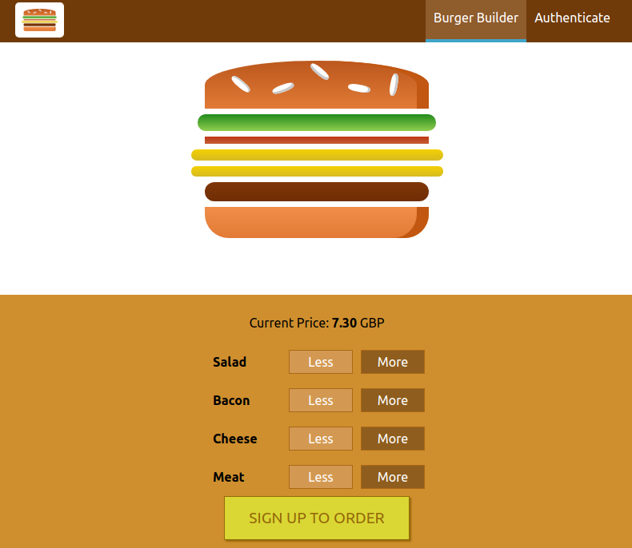

**Burger Builder**

This is a single page application built using React JS and ReduxJS.

Which deployed on Google FireBase:  [Ready to order a delicious burger !?](https://my-burger-burger-fd244.web.app/)

And looks like this

This project was bootstrapped with [Create React App](https://github.com/facebookincubator/create-react-app).

## Available Scripts

In the project directory, you can run:

### `npm install`

Installs all the required dependencies in the local `node_modules` folder

### `npm start`

Runs the app in the development mode. 
Open [http://localhost:3000](http://localhost:3000) to view it in the browser.

The page will reload if you make edits. 
You will also see any lint errors in the console.

### `npm test`

Launches the test runner in the interactive watch mode. 
See the section about [running tests](#running-tests) for more information.

### `npm run build`

Builds `build` folder which contains an optimized production  build. 

Your app is ready to be deployed!

